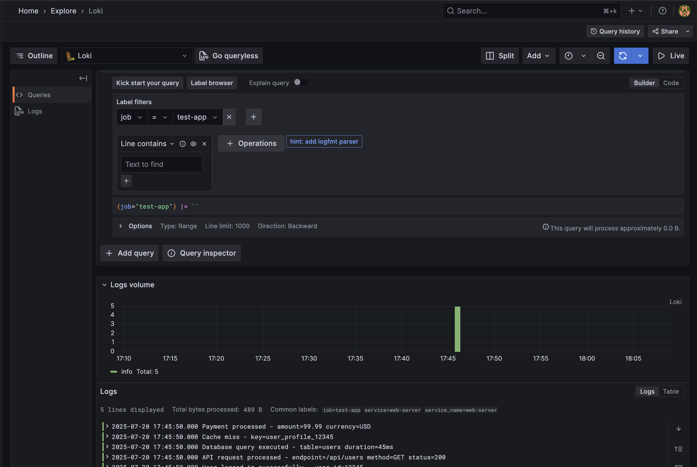
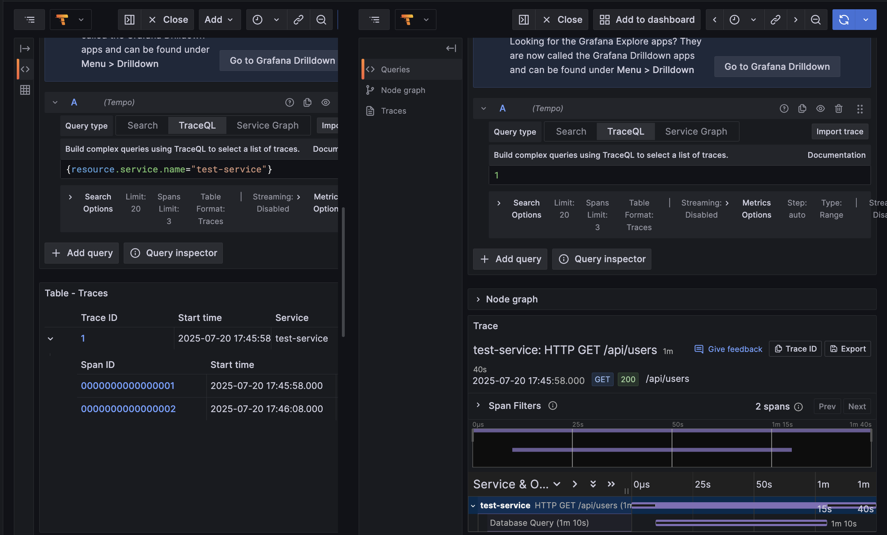

# LGT (Loki, Grafana, Tempo) Stack Setup

## Architecture

- **Grafana**: Web-based analytics and monitoring platform (port 3000)
- **Loki**: Log aggregation system (port 3100)
- **Tempo**: Distributed tracing backend (port 3200)

## Prerequisites

- Docker
- Docker Compose

To initialize this configuration locally, follow these steps:

- We will first create the necessary volumes for Loki, Grafana, and Tempo.

```bash
chmod +x setup-volumes-simple.sh

sh setup-volumes-simple.sh
```

- Make sure you have docker and docker-compose installed, then run:

```bash
docker-compose up
```

- This will start the LGT stack with Loki, Grafana, and Tempo running on your local machine on the following ports:

  - **Grafana**: [http://localhost:3000](http://localhost:3000)
  - **Loki**: [http://localhost:3100](http://localhost:3100)
  - **Tempo**: [http://localhost:3200](http://localhost:3200)

- For Grafana, the default login is:
  - **Username**: admin
  - **Password**: admin

## Health Checks

All services include health checks:

- **Grafana**: [http://localhost:3000/api/health](http://localhost:3000/api/health)
- **Loki**: [http://localhost:3100/ready](http://localhost:3100/ready)
- **Tempo**: [http://localhost:3200/ready](http://localhost:3200/ready)

## Data Persistence

Data is stored in local directories:

- `./volumes/loki-data/` - Loki logs and chunks
- `./volumes/tempo-data/` - Tempo traces and blocks
- `./volumes/grafana-data/` - Grafana dashboards and settings

## Send Test Data

### Send Logs

```bash
./send-test-logs.sh
```

### Send Traces

```bash
./send-test-traces.sh
```

## Accessing the Logs and Trace on Grafana dashboard

1. Open your web browser and navigate to [http://localhost:3000](http://localhost:3000).
2. Log in with the default credentials:
   - **Username**: admin
   - **Password**: admin
3. Once logged in, go to explore section to visualize the logs and traces sent to Loki and Tempo as shown in the image below:

- For Logs:

- For Traces:

